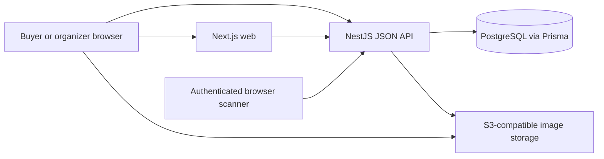

# Architecture

[Documentation index](../README.md)

## Current system

Passmint is a pnpm monorepo with a Next.js frontend and NestJS API. PostgreSQL stores users, events and tickets through Prisma. Event images use S3-compatible storage, with MinIO in the local Compose environment. A filesystem storage branch also exists.

This diagram contains the current main components. There is no implemented payment provider, email service, background job queue or independent tenant service.

## Component responsibilities

| Component | Responsibility | Entry point |
| --- | --- | --- |
| Web routes and React components | Discovery, auth UI, organizer UI, checkout and scanning | [Web app](../../apps/web/app/page.tsx), [app provider](../../apps/web/components/app-provider.tsx) |
| API client | JSON requests and bearer headers | [api.ts](../../apps/web/api.ts) |
| API bootstrap | CORS, 7 MB request parsing, DTO validation, local uploads | [main.ts](../../apps/api/src/main.ts) |
| Authentication | Register, login, token verification and database user lookup | [auth service](../../apps/api/src/auth/auth.service.ts) |
| Events | Ownership, drafts, publication, cancellation, capacity and categories | [events service](../../apps/api/src/events/events.service.ts) |
| Tickets/gate | Direct issuance, history, inventory and scan validation | [tickets service](../../apps/api/src/tickets/tickets.service.ts) |
| Image storage | Base64 validation, object key generation and signed upload | [storage service](../../apps/api/src/events/image-storage.service.ts) |
| Persistence | Schema and connection lifecycle | [Prisma schema](../../prisma/schema.prisma), [Prisma service](../../apps/api/src/prisma/prisma.service.ts) |

## Request and transaction behavior

The browser sends bearer tokens to the API. Protected routes require a valid token; optional-auth routes permit guests. Verification reads the current database user, so authorization uses the stored role. Frontend session state is stored in browser local storage.

Ticket creation locks the event row inside a database transaction, validates event and optional category availability, counts active tickets, checks repeat-email confirmation and creates one row per ticket. QR rendering happens after that transaction. A rendering/response failure therefore need not mean issuance failed; no idempotency key is implemented for replaying the purchase request.

Capacity edits, category writes, event cancellation and scans also use the event row as a lock boundary. This simplifies consistency within one event but can serialize a busy event's sales and gate traffic. No load benchmark establishes its maximum throughput.

Gate validation looks up the code, checks ownership/admin privileges and cancellation/used state, then records `checked_in` and a timestamp. The current scan request contains only the code; it has no explicit selected gate or occurrence, and the service does not enforce an event-time validity window.

## Publication and demo behavior

The event service publishes due drafts during startup, on a 30-second timer and during selected reads/purchases. It is an in-process mechanism, not a durable job queue. Each API process can run the timer; failure is logged and retried on a later tick.

Development startup inserts the catalog in `apps/api/src/events/seed-data` with stable IDs and recognizes older seed rows by name to avoid duplicates. New records are scheduled more than one month ahead. Artwork is committed under `apps/api/seed-data`, processed through event image storage, and served from stable first-party seed keys. Production skips this unless `SEED_DEMO_DATA=true`. Server and client demo fallback is disabled in production, so API errors do not become sample inventory. Exclude any deliberately seeded records from commercial reporting.

## Deployment shape and dependencies

Local development runs the web and API as separate processes and PostgreSQL/MinIO in Docker. Production uses one non-root image: a Node supervisor starts Next.js on port 8088 and the API on private loopback port 3000, forwards termination signals and exits if either child fails. Next.js proxies browser `/api` calls to the API; server fetches use `API_INTERNAL_URL`. The container health check calls `/api/ready`, which tests database connectivity. See the [deployment guide](../deployment.md) for configuration and empty-database initialization.

`NEXT_PUBLIC_API_URL` is used by browser and server web code and must be correct at build time. A URL reachable only inside a container will fail for browsers; a localhost URL may point to the wrong process inside containers. Separate public/internal endpoint handling is not implemented.

## Future architecture boundary

The proposed model adds Tenant → Activity → Occurrence, reusable resources and layout versions, orders/payments, inventory holds and admission entitlements. This is a roadmap, not the current schema. Existing event IDs, ticket codes and ownership history need a deliberate migration. Do not introduce separate vertical databases or services merely because the product supports different activity names.
