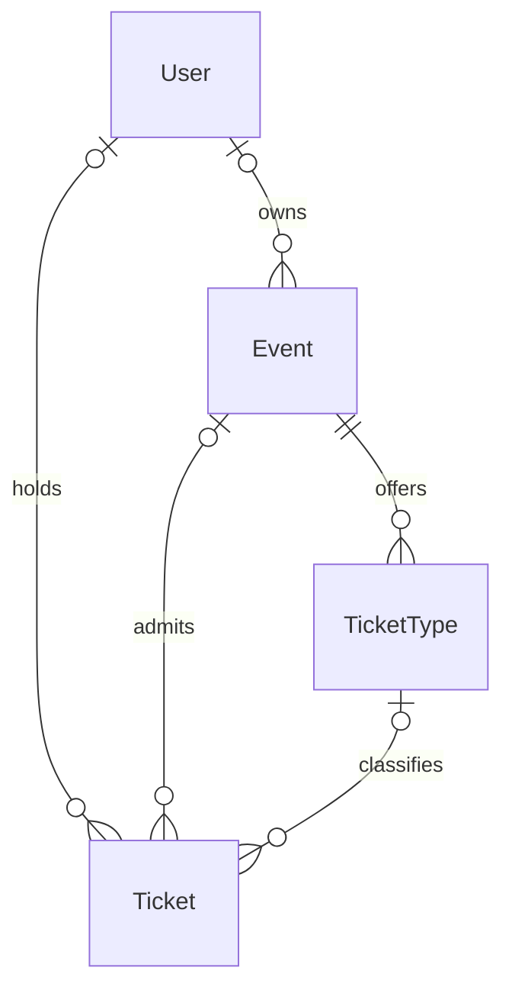

# Data dictionary and lifecycle

[Documentation index](../README.md)

The authority is [prisma/schema.prisma](../../prisma/schema.prisma). The dictionary includes the local ticket-type additions. There are four models, no tenant, occurrence, order, payment, seat, refund or audit-ledger tables.

## Entities

| Entity / table | Fields and meanings |
| --- | --- |
| User / `users` | `id` prefixed `usr_`; unique normalized `email`; `name`; salted `passwordHash`; `role` enum `user` or `admin`; `createdAt`, `updatedAt` |
| Event / `events` | `id` prefixed `evt_`; `name`, `description`, `venue`; optional `mapLocation`, `thumbnailUrl`; `startsAt`; optional `capacity`; integer `priceCents`; optional `ownerId`; string `status` default `published`; nullable `cancelledAt`, `publishAt`; creation/update timestamps |
| Ticket / `tickets` | `id` prefixed `tkt_`; unique random `code`; required `buyerName`, normalized `buyerEmail`; `status` enum `issued`, `checked_in`, `cancelled`; optional `checkedInAt`; nullable `eventId`, `ownerId`, `ticketTypeId`; category-name snapshot `ticketTypeName`; optional price snapshot `unitPriceCents`; creation/update timestamps |
| TicketType / `ticket_types` | `id` prefixed `typ_`; required `eventId`; `name`, integer `priceCents`; nullable `capacity`; `maxPerOrder` default 10; optional `salesStart`, `salesEnd`; `createdAt`; index on `eventId` |

IDs use a UUID with hyphens removed after the prefix. Ticket codes are separate UUIDs. Database uniqueness protects user email and ticket code. There is no unique buyer-email/event constraint because additional purchases are permitted.

## Nulls, ownership and deletion

Null event/category capacity means unlimited at that level. An event limit still applies when a category has unlimited capacity. Guest tickets have no user owner but retain buyer contact information. Historical/seed events can have no owner.

Deleting a User sets event and ticket ownership references to null. Deleting an Event cascades to its tickets and ticket types. The ticket-type relation uses Prisma's default referential action rather than an explicit `onDelete` declaration. No public deletion endpoint was found. Database deletion is not a substitute for a reviewed retention process; an event cascade can remove admission history.

## Time, money and computed values

`startsAt`, `publishAt`, `cancelledAt` and `checkedInAt` use timezone-aware PostgreSQL timestamps. User/Event/Ticket creation/update timestamps use timestamp without timezone; TicketType creation uses the Prisma default mapping. No IANA timezone field exists for an event. The UI formats with `en-UG` and the runtime's timezone.

Prices are integer fields named `priceCents`; UI rendering divides by 100 and formats UGX. For example, 2,500,000 renders as UGX 25,000. There is no persisted currency field. A future provider integration must explicitly define its amount conversion rather than assume the existing name matches provider units.

`ticketsSold` counts non-cancelled tickets, including checked-in tickets; it does not measure paid sales. Remaining capacity is capacity minus that count, clamped to zero. Category availability additionally considers sale windows. Event cancellation independently stops purchases. Repeat-email count currently includes cancelled tickets as well as active tickets.

## Lifecycles

An event is created published or as a draft. A valid draft can be published manually or scheduled. Cancellation preserves records and prevents editing, new issuance and validation; drafts cannot be cancelled through the current cancel endpoint. There is no archive lifecycle or general unpublish endpoint in the inspected controller.

A ticket starts `issued` and becomes `checked_in` on acceptance. `cancelled` exists in the schema and is checked by inventory/gate logic, but there is no public individual-ticket cancellation endpoint. Event cancellation does not rewrite every ticket status. Refunds, transfers and re-entry are not current lifecycle operations.

Ticket category name and unit price are snapshotted in the local additions; other event details in ticket responses come from the current event record. Editing a venue/time can therefore change displayed ticket details without a separate event-change notification. Legacy null ticket prices fall back to the current event price.

## Data classification and proposed handling

| Data | Intended audience | Handover treatment |
| --- | --- | --- |
| Published event descriptions and artwork | Public | Include in catalog only with content-rights confirmation |
| Draft events | Owner | Do not include in public exports |
| User/buyer names, email, account IDs and attendance | Restricted | Use sanitized demonstrations; transfer real records only through approved data-room process |
| Password hashes, bearer tokens and QR codes | Security-sensitive | Exclude from ordinary diligence exports and logs |
| Storage/database credentials | Secret | Transfer through a secrets manager, never document values here |

The mobile-money number is accepted by the DTO but not persisted by the current ticket service/schema. Hosting logs or other external systems have not been inspected. Retention periods, erasure/export workflows, consent records and backup retention are owner-confirmation items. No production data was inspected to prepare this package.
